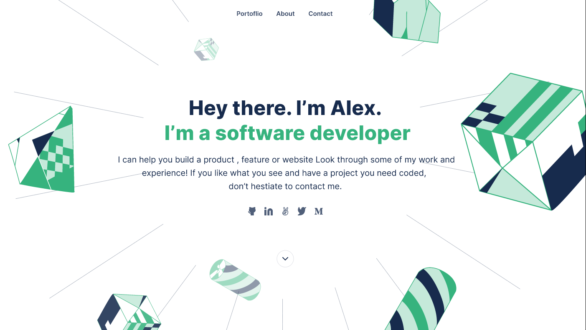

# my-portfolio

> Portfolio website to showcase my work as a developer.

## Built With

- html
- css

## Getting Started

To get a local copy up and running follow these simple example steps.
-fork this repostory
-clone it to your local machine 
-make changes

## Authors

👤 **Author1**

- GitHub: [@KanoCode](https://github.com/KanoCode)
- Twitter: [@Kanombola_s](https://twitter.com/Kanombola_s)
- LinkedIn: [LinkedIn](https://www.linkedin.com/in/kanombola-kanombola-a38b061a4/)

## 🤝 Contributing

Contributions, issues, and feature requests are welcome!

Feel free to check the [issues page](../../issues/).
## Acknowledgments

- Hat tip to anyone whose code was used
- Thank you for the code icon Stockio: [Flaticon](https://www.flaticon.com/authors/Stockio)

## Show your support

Give a ⭐️ if you like this project!

## 📝 License

This project is [MIT](./MIT.md) licensed.

